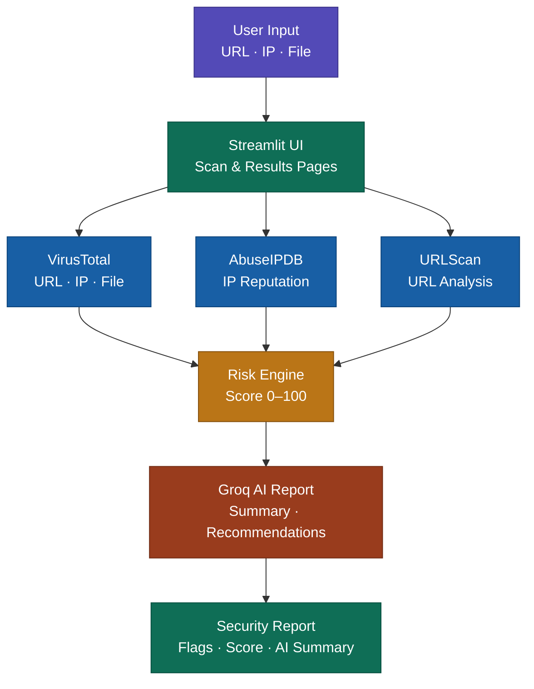

# Architecture Diagram

```mermaid
flowchart TD
    A[User Input\nURL · IP · File] --> B[Streamlit UI\nScan & Results Pages]

    B --> C[VirusTotal\nURL · IP · File]
    B --> D[AbuseIPDB\nIP Reputation]
    B --> E[URLScan\nURL Analysis]

    C --> F[Risk Engine\nScore 0–100]
    D --> F
    E --> F

    F --> G[Groq AI Report\nSummary · Recommendations]
    G --> H[Security Report\nFlags · Score · AI Summary]

    style A fill:#534AB7,color:#fff,stroke:#3C3489
    style B fill:#0F6E56,color:#fff,stroke:#085041
    style C fill:#185FA5,color:#fff,stroke:#0C447C
    style D fill:#185FA5,color:#fff,stroke:#0C447C
    style E fill:#185FA5,color:#fff,stroke:#0C447C
    style F fill:#BA7517,color:#fff,stroke:#854F0B
    style G fill:#993C1D,color:#fff,stroke:#712B13
    style H fill:#0F6E56,color:#fff,stroke:#085041
```
